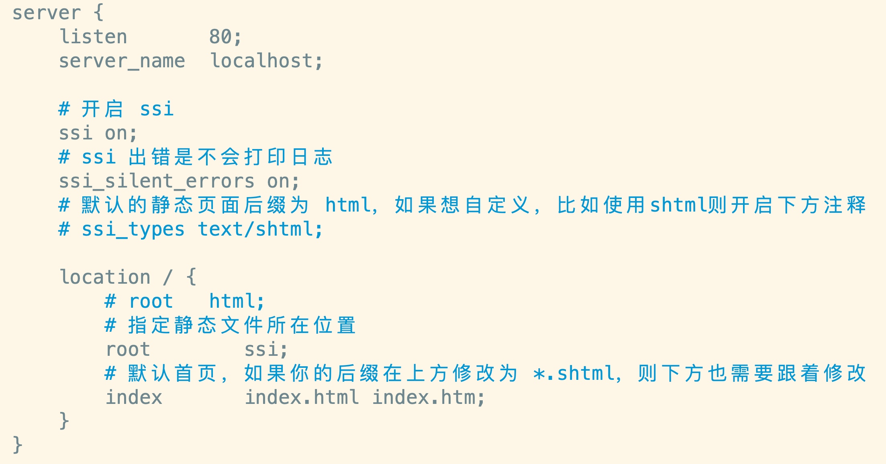
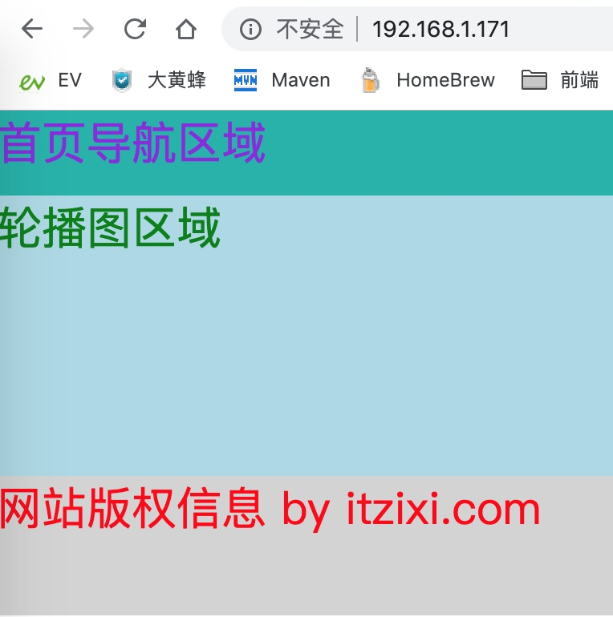

# SSI 网页内嵌技术
### 引子
一般来说我们开发网页的时候，大多都会以一个大的HTML页面来做，来开发，来发布，来维护。初期可能就1-2人维护，随着业务发展，功能迭代，一个首页会相当复杂，那么就有可能会有一个团队来维护，首页包含的功能会有很多，比如，轮播图，分类，商品推荐，广告等等，可以看一下京东：


以上三张图中的红框部分，其实都是每个页面中的一个小功能，他们都可以单独拿出来作为一个单独的页面，随后再嵌入到页面中，如此一来，就更加便于团队的开发和维护了，同时也能提供公用化的功能，减少重复代码。

### SSI
那么如何进行网页内嵌呢，我相信尽力过jsp时代的应该会知道include，其实我们这里使用的原理也是一样的。

SSI就是server side include，网页服务端内嵌技术，像Apache，Nginx都支持。可以把页面拆分成小页面后，再合并聚合在一起显示给用户。

ssi的可定义扩展名为：*.stm、* *.shtm、* *.shtml*

### 标签使用
如下，看似和jsp的include是类似的，道理也是一样的
```
<!--#include virtual="/pages/index/abc.html"  -->
```

### 在nginx中配置ssi
* 如何安装nginx的，不多说了，参考我以前的博客：
https://www.cnblogs.com/leechenxiang/p/7086298.html

* 准备如下页面，主要是配置首页的include标签：

* nginx中的ssi配置如下：

* nginx.conf 配置：
```
    server {
        listen       80;
        server_name  localhost;

        # 开启 ssi
        ssi on;
        # ssi 出错是不会打印日志
        ssi_silent_errors on;
        # 默认的静态页面后缀为 html，如果想自定义，比如使用shtml则开启下方注释
        # ssi_types text/shtml;

        location / {
            # root   html;
            # 指定静态文件所在位置
            root        ssi;
            # 默认首页，如果你的后缀在上方修改为 *.shtml，则下方也需要跟着修改
            index       index.html index.htm;
        }
    }
```

* html如下：



* github地址：

### 精品推荐
如果你是一名java开发人员，在如此激烈的竞争中，为亲爱的你推荐如下架构师进阶课程噢~
https://class.imooc.com/sale/javaarchitect


